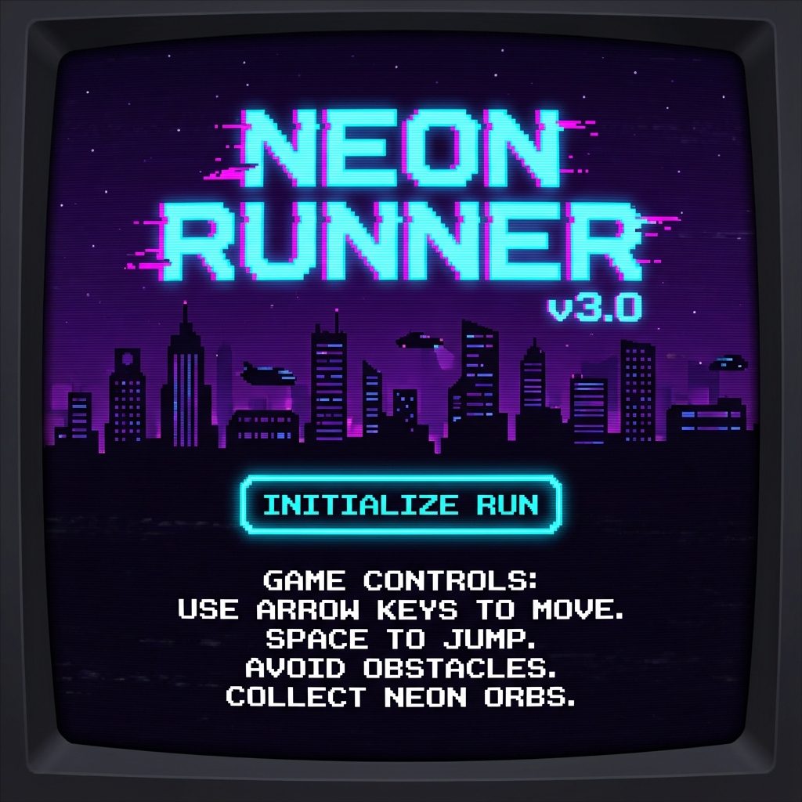
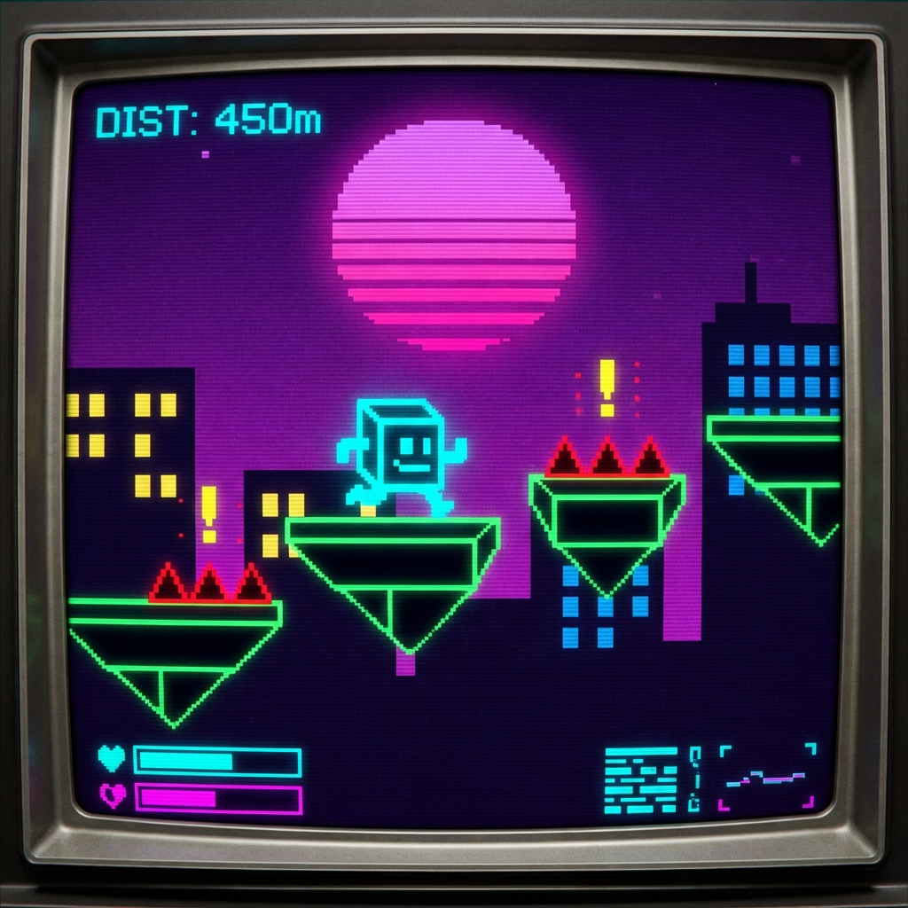
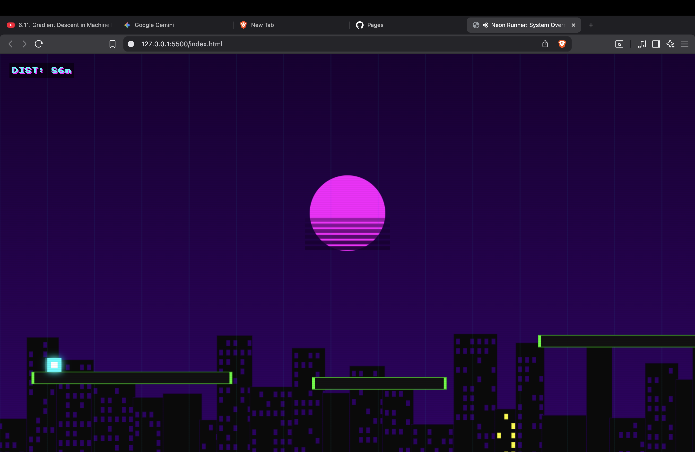
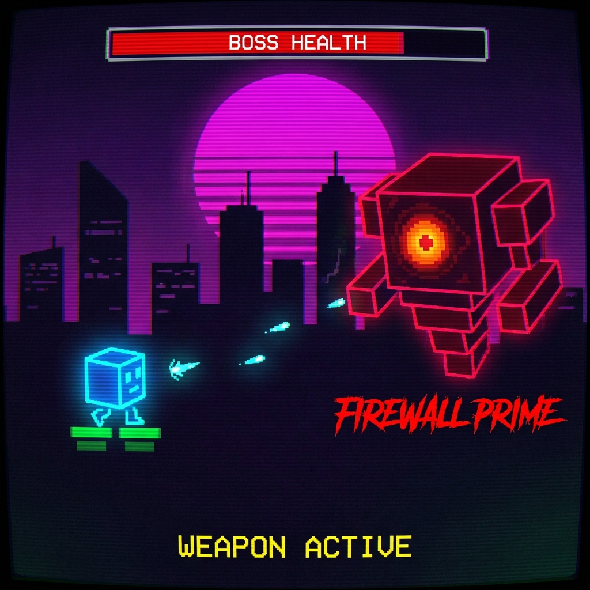
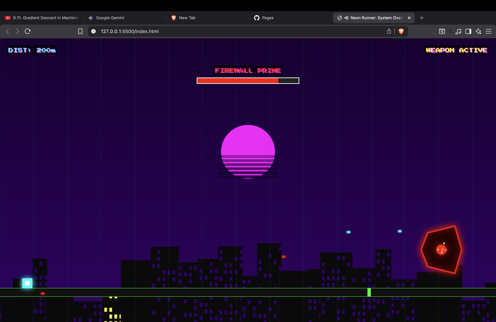
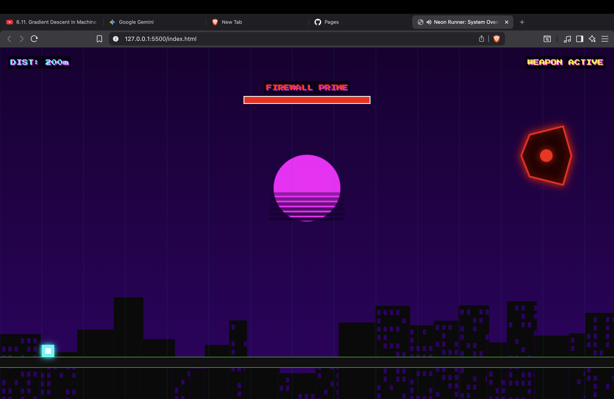
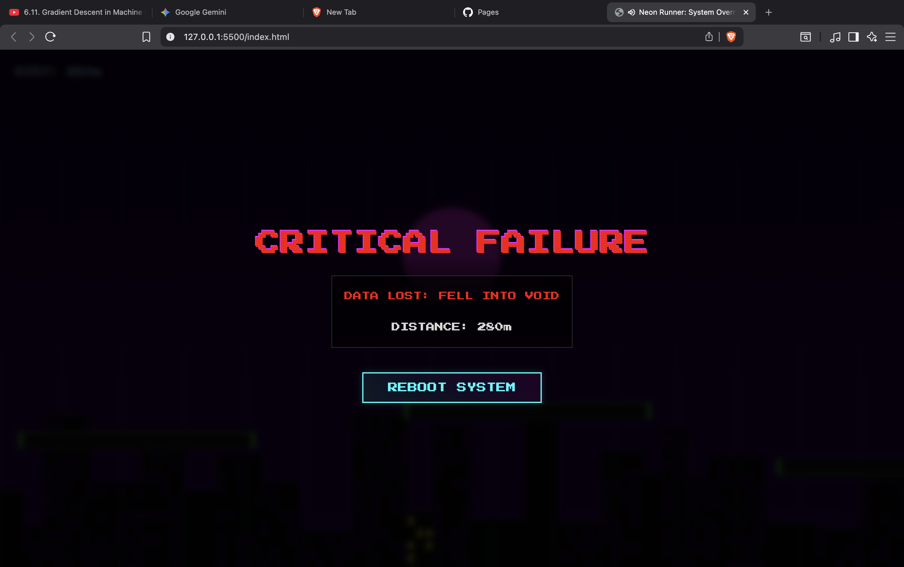

# 🎮 NEON RUNNER: System Override

<div align="center">



**A retro-cyberpunk endless runner with synthwave aesthetics and intense boss battles**

🎮 **[PLAY NOW - Live Demo](https://bhanu2006-24.github.io/neon-runner/)** 🎮

[](LICENSE)
[]()
[](https://bhanu2006-24.github.io/neon-runner/)
[]()

[Play Now](#how-to-play) • [Features](#features) • [Controls](#controls) • [Author](#-author) • [License](#license)

</div>

---

## 📖 About

**Neon Runner** is a high-speed cyberpunk endless runner built with pure vanilla JavaScript and HTML5 Canvas. Navigate through a dystopian cyber city, dodge deadly spike traps, and face off against the ultimate **Firewall Prime** boss in an epic battle for survival.

Experience retro 80s synthwave aesthetics with:
- 🌆 Dynamic parallax cityscape with glowing neon buildings
- 🌅 Animated retro sun with horizontal stripes
- ⚡ Particle effects and smooth animations
- 🎵 Procedurally generated chiptune music
- 📱 Full mobile support with touch controls

---

## 🎬 Game Screenshots

<div align="center">

### 🏃 Gameplay Action
<table>
<tr>
<td width="50%">

<p align="center"><em>Navigate neon platforms in the cyber city</em></p>
</td>
<td width="50%">

<p align="center"><em>High-speed running through obstacles</em></p>
</td>
</tr>
</table>

### ⚔️ Boss Battles
<table>
<tr>
<td width="33%">

<p align="center"><em>Firewall Prime encounter</em></p>
</td>
<td width="33%">

<p align="center"><em>Epic boss showdown</em></p>
</td>
<td width="33%">

<p align="center"><em>Intense boss combat</em></p>
</td>
</tr>
</table>

### 💀 Game Over
<p align="center">

<br><em>System failure - Try again!</em>
</p>

</div>

---

## ✨ Features

### 🎯 Core Gameplay
- **Endless Running**: Navigate procedurally generated platforms
- **Double Jump**: Master aerial movement with a secondary jump
- **Spike Traps**: Avoid deadly hazards marked with warning icons
- **Boss Battle**: Face the epic Firewall Prime at 1000m
- **Weapon System**: Unlock shooting abilities during boss encounters

### 🎨 Visual Design
- **Synthwave Aesthetics**: Purple/magenta gradient skies with neon accents
- **Dynamic Background**: Parallax scrolling cityscape with animated windows
- **Retro Sun**: Classic synthwave sun with horizontal stripe effects
- **Particle Systems**: Explosions, jumps, and impacts with visual feedback
- **CRT Scanlines**: Authentic retro gaming feel

### 🎵 Audio
- **Procedural Music**: WebAudio-powered chiptune BGM
- **Sound Effects**: Jump, shoot, explosion, and impact sounds
- **Dynamic Audio**: Context-aware music and effects

### 📱 Platform Support
- **Desktop**: Keyboard controls (SPACE, Z)
- **Mobile**: Touch controls with on-screen fire button
- **Responsive**: Adapts to any screen size

---

---

## 🕹️ Controls

### Desktop
| Key | Action |
|-----|--------|
| `SPACE` | Jump / Double Jump |
| `Z` | Shoot (Boss Battle) |

### Mobile
| Control | Action |
|---------|--------|
| Tap Screen | Jump / Double Jump |
| Fire Button | Shoot (Boss Battle) |

---

## 🚀 How to Play

### Quick Start

**🎯 Play Instantly**: [https://bhanu2006-24.github.io/neon-runner/](https://bhanu2006-24.github.io/neon-runner/)

### Local Installation
1. Clone this repository:
   ```bash
   git clone https://github.com/bhanu2006-24/neon-runner.git
   cd neon-runner
   ```

2. Open `index.html` in your browser:
   ```bash
   # Using Python
   python -m http.server 8000
   
   # Or just open directly
   open index.html
   ```

3. **That's it!** No build process required - pure vanilla JavaScript!

### Gameplay Tips
1. **Watch for Warning Icons**: Yellow `!` icons mark deadly spike traps
2. **Master Double Jump**: Essential for avoiding hazards and navigating platforms
3. **Reach 1000m**: The boss battle triggers at this milestone
4. **Aim Carefully**: During boss battles, shoot the Firewall Prime to deplete its health
5. **Stay Alive**: Don't fall into the void or collide with spikes!

---

## 🛠️ Technical Details

### Built With
- **HTML5 Canvas**: Core rendering engine
- **Vanilla JavaScript**: No frameworks or dependencies
- **WebAudio API**: Procedural sound generation
- **CSS3**: UI styling and effects

### Architecture
- **Object-Oriented Design**: Clean class-based structure
- **Game Loop**: RequestAnimationFrame for smooth 60 FPS
- **Particle System**: Dynamic visual effects
- **Collision Detection**: AABB (Axis-Aligned Bounding Box)
- **Parallax Scrolling**: Multiple background layers

### File Structure
```
neon-runner/
├── index.html          # Complete game in a single file
├── README.md           # This file
├── LICENSE             # MIT License
└── .gitignore         # Git ignore rules
```

---

## 🎯 Game Mechanics

### Progression System
- **Distance-Based**: Track your progress in meters
- **Boss Threshold**: Boss spawns at 1000m
- **Difficulty Scaling**: Speed increases as you progress

### Obstacle System
- **Platform Generation**: Procedural platform spawning
- **Spike Traps**: Random hazard placement with visual warnings
- **Collision Detection**: Precise hitbox calculations

### Boss Battle
- **Phase Trigger**: Activates at 1000m distance
- **Health System**: Boss has 100 HP, player deals 4 damage per hit
- **AI Behavior**: Boss moves vertically and shoots projectiles
- **Win Condition**: Defeat boss to win the game

---

## 📝 Development

### Future Enhancements
- [ ] Power-ups and collectibles
- [ ] Multiple boss types
- [ ] Local high score storage
- [ ] Additional obstacle varieties
- [ ] Custom color themes
- [ ] More music tracks

### Contributing
Contributions are welcome! Feel free to:
- Report bugs
- Suggest new features
- Submit pull requests
- Improve documentation

---

## 📄 License

This project is licensed under the MIT License - see the [LICENSE](LICENSE) file for details.

---

## 👨‍💻 Author

<div align="center">

### Bhanupratap Saini

**Full-Stack Developer | Game Developer | Open Source Enthusiast**

[](https://github.com/bhanu2006-24)
[](https://bhanu2006-24.github.io/neon-runner/)

</div>

---

### 🚀 About Me

Passionate developer crafting interactive experiences with a focus on:
- 🎮 **Game Development**: Building engaging browser-based games with vanilla JavaScript
- 💻 **Web Development**: Creating responsive, performant web applications
- 🎨 **UI/UX Design**: Designing visually stunning interfaces with modern aesthetics
- ⚡ **Performance**: Optimizing code for smooth 60 FPS experiences

### 🛠️ Tech Stack

**Languages & Frameworks:**
- JavaScript (ES6+), HTML5, CSS3
- Canvas API, WebAudio API
- React, Node.js

**Game Development:**
- HTML5 Canvas rendering
- Procedural generation algorithms
- Physics simulations
- Real-time audio synthesis

**Tools & Practices:**
- Git & GitHub
- Responsive design
- Object-oriented programming
- Game optimization techniques

### 📫 Get in Touch

Interested in collaborating or want to discuss game development? Feel free to reach out!

- 💼 Check out my other projects on [GitHub](https://github.com/bhanu2006-24)
- 🎮 Play my games and provide feedback
- 🌟 Star this repo if you enjoyed the game!

---

## 🙏 Acknowledgments

- Inspired by classic endless runner games
- Synthwave aesthetic inspired by 1980s retro futurism
- Press Start 2P font from Google Fonts

---

<div align="center">

**Made with ⚡ and lots of ☕**

*Ready to run? [Start Playing](#how-to-play)*

</div>
